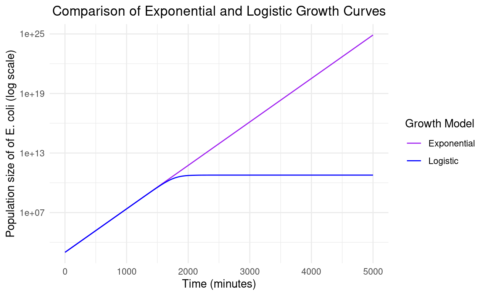

## Question 1: Logistic Growth Analysis & Estimates for N0, r and K

### Analysis

* I used data from the experiment.csv file which I saved into a dataframe called growth_data. This file includes data showing the change to an E.coli population isolate over time when suspended in growth media.
* Bacteria were cultured in....
* data set recorded at t intervals
* parameters estimated

### Plotting raw data

* In  "plot_data.R" script I used the "ggplot2" package to firstly plot population (N) over time (t) in order to see how the population changes over time. This gives a graph with an S-shaped curve is characteristic of logistic growth. The population initially is in a lag phase as the population is adjusting to the environment of the growth medium and N is small so there are fewer individuals reproducing. After N increases, the population then experiences exponential growth as the concentration of resources in the environment are abundant. The depletion of resources and increase in competition then results in a deceleration phase, and the population then stabilises around the carrying capacity (K).
  
* As the growth curve appeared logistic, I produced a second plot that was semilog, transforming the y variable by log 10. This results in the exponential phase of logistic growth into a straight line meaning it is easier to analyse and estimate the intrinsic growth rate (r)

### Fitting linear models

* In the "fit_linear_model_R" script, I then used the "dyplr" package to filter the dataset.
* In case 1, I created a data subset where N was below the carrying capacity (K) which occurs when t is low (t>1500), using the "mutate" function to make a new column where values of N are logarithmic.
* I then used the "lm" function to fit a linear model of N(log) against t, which we can use to estimate initial population size (N0) and intrinsic population growth rate (r)
* Also in the "fit_linear_model_R) script I created a second subset where the population has reached carrying capacity so N(t) = K and so made t>3000 as this is where the population had reached equilibrium. Again I fit a linear model which can be used to estimate K.

* Add linear approximation & assumptions

### Logistic Model

* In the "plot_data_and_model.R" script I created a function which defines a logistic growth model, and plotted N against t to see how well the data fit a logistic model

### Results:

* From the intercept of my first linear model I could estimate N0 to be 985 (e6.8941709)
* From the slope of my first linear model I could estimate r to be 0.0100086
* The slope of my second linear model meant I could estimate K to be 60000000000 (6.000e+10)
   
* This gives the estimates of N0 = 985, r = 0.010086, and K = 6.000e+10

## Question 2: Calculating population size at t = 4980 minutes

* Assuming the population grows exponentially, at: t = 4980 min, N = N0*exp(r*t) = 985*exp(0.010086*4980) = **6e+10**
  
* Whereas under exponential growth, at t = 4980 min, N = (N0*K*exp(r*t))/(K-N0+NO*exp(r*t)) = (985*6.000e+10(0.010086*4980))/ (6.000e+10-985*exp(0.010086*4980)) = **6.42e+24**

* The estimate under under exponential growth is less than under logistic growth because growth under logistic growth is limited by the population's carrying capacity. The exponential model assumes population growth is not limited by density dependent factors so is unbounded.

## Question 3: Comparing exponential and logistic growth curves

* Code for plot below is in the "exp_log_plot.png"
* Graph shows how when logistic growth occurs (blue line), the population is limited by its carrying capacity. Whereas for exponential growth (purple line), the population grows without bounds

